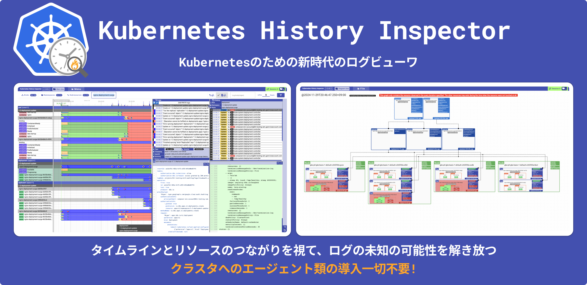
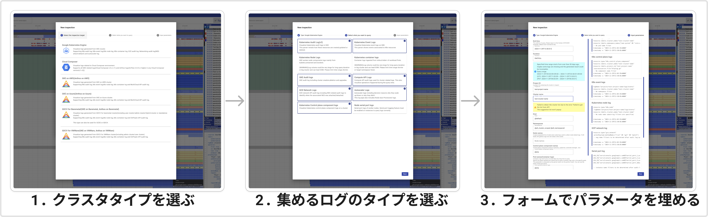
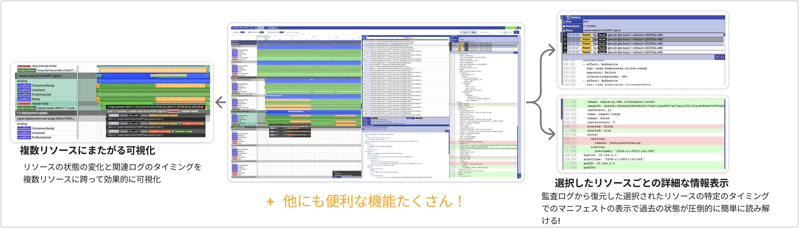
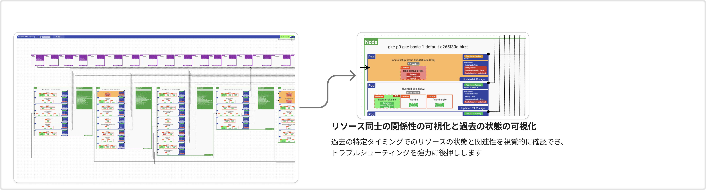

# Kubernetes History Inspector

Language: [English](./README.md) | 日本語



Kubernetes History Inspector (KHI) は、Kubernetesクラスタのログ可視化ツールです。
大量のログをインタラクティブなタイムラインビューなどで可視化し、Kubernetesクラスタ内の複数のコンポーネントにまたがる複雑な問題のトラブルシューティングを強力にサポートします。

## 機能と特徴

- **事前設定不要:** クラスタ内のエージェントなどの事前導入を必要とせず、既存のログから可視化を提供します。さらに、ログがログバックエンド上に保持されている限り、過去の問題のトラブルシューティングにも活用できます。

- **圧倒的に簡単なログ収集:** KHIは、Kubernetes関連ログの収集を大幅に簡素化します。複雑なログフィルタを記述せず、インタラクティブなGUIを利用してクエリを生成・実行できます。



- **インタラクティブなタイムラインによる包括的なクラスタの可視化:** さまざまなログを用いて、クラスタ上で発生した事象を包括的に可視化します。
  - **リソース履歴の可視化:** リソースの状態をタイムライン上に表示します。また、監査ログを解析し変更履歴を確認できます。
  - **複数のリソースタイプにわたる複数のログタイプの可視化:** 関連リソース間のさまざまな種類のログを関連付け、全体像を提供します。
  - **リソース間のログのタイムライン比較:** タイムラインビューでは、リソース間のログを時間軸で比較できるため、関係性と依存関係を容易に特定できます。
  - **強力なインタラクティブフィルター:** ログの処理をインメモリで処理することで、対話的にログをフィルタリングし、大規模なデータセット内から必要な情報を迅速に特定できます。



- **リソースの関連性の可視化 (アルファ機能):** 特定の時点での Kubernetes クラスタのリソースの状態とそれらの関係を示す図を生成できます。これにより、インシデント発生時のクラスタにおけるリソース同士の関連性を把握できます。



## システム要件

### Kubernetesクラスタ

- Google Cloud
  - [Google Kubernetes Engine](https://cloud.google.com/kubernetes-engine/docs/concepts/kubernetes-engine-overview)
  - [Cloud Composer](https://cloud.google.com/composer/docs/composer-3/composer-overview)
  - [GKE on AWS](https://cloud.google.com/kubernetes-engine/multi-cloud/docs/aws/concepts/architecture)
  - [GKE on Azure](https://cloud.google.com/kubernetes-engine/multi-cloud/docs/azure/concepts/architecture)
  - [GDCV for Baremetal](https://cloud.google.com/kubernetes-engine/distributed-cloud/bare-metal/docs/concepts/about-bare-metal)
  - [GDCV for VMWare](https://cloud.google.com/kubernetes-engine/distributed-cloud/vmware/docs/overview)

- その他環境
  - （近日公開予定）JSONlines形式のkube-apiserver監査ログ

### ログバックエンド

- Google Cloud
  - Cloud Logging（Google Cloud上のすべてのクラスタ）

- その他環境
  - （近日公開予定）ファイルによるログアップロード

## 実行方法
### Dockerイメージから実行
#### 動作環境
- Google Chrome（最新版）

> [!IMPORTANT]
> 動作環境以外でのご利用、または動作環境下でもブラウザの設定によっては正しく動作しない場合がございます。

#### KHIの実行

1. [Cloud Shell](https://shell.cloud.google.com) を開きます。
2. `docker run -p 127.0.0.1:8080:8080 asia.gcr.io/kubernetes-history-inspector/release:latest` を実行します。
3. ターミナル上のリンク `http://localhost:8080` をクリックして、KHI の使用を開始してください！

> [!TIP]
> メタデータサーバーが利用できない他の環境でKHIを実行する場合は、プログラム引数でアクセストークンを渡します。
>
> ```
> $ docker run -p 127.0.0.1:8080:8080 asia.gcr.io/kubernetes-history-inspector/release:latest -access-token=`gcloud auth print-access-token`
> ```

> [!NOTE]
> コンテナイメージの配信元は近いうちに変更される可能性があります。 #21

詳細は [Getting Started](./docs/en/getting-started.md) を参照してください。

### ソースから実行

<details>
<summary>動かしてみる (ソースから実行)</summary>

#### 動作環境
- Go 1.23.*
- Node.js環境 22.13.*
- [`gcloud` CLI](https://cloud.google.com/sdk/docs/install)
- [`jq`コマンド](https://jqlang.org/)

#### 環境構築
1. このリポジトリをダウンロードまたはクローンします。  
  例: `git clone https://github.com/GoogleCloudPlatform/khi.git`
2. プロジェクトルートに移動します。  
  例: `cd khi`
3. プロジェクトルートから `cd ./web && npm install` を実行します。

#### KHIの実行
1. [`gcloud` で認証します。](https://cloud.google.com/docs/authentication/gcloud)  
  例: ユーザーアカウントの認証情報を使用する場合は、`gcloud auth login` を実行します。
2. プロジェクトルートから `make build-web && KHI_FRONTEND_ASSET_FOLDER=./dist go run cmd/kubernetes-history-inspector/main.go` を実行します。  
  `localhost:8080` を開き、KHIの使用を開始してください！

</details>

> [!IMPORTANT]
> KHIのポートをインターネット向けに公開しないでください。
> KHI自身は認証、認可の機能を提供しておらず、ローカルユーザからのみアクセスされることが想定されています。

### 権限設定
## マネージド環境毎の設定

### Google Cloud

#### 権限

以下の権限が必須・推奨されます。

**必須権限**

* `logging.logEntries.list`

**推奨権限**

* 対象のクラスタのタイプに対するリスト権限（例：GKEの場合 `container.clusters.list`）

   ログフィルタ生成ダイアログの候補の出力に使用します。KHIの主機能の利用に影響はありません。

##### 設定手順

* Compute Engine仮想マシン上など、サービスアカウントがアタッチされたGoogle Cloud環境でKHIを実行する場合、対応するリソースにアタッチされたサービスアカウントに上記権限を付与します。
* ローカル環境やCloud Shellなど、ユーザアカウント権限でKHIを実行する場合、対応するユーザ上記権限を付与します。

> [!WARNING]
> KHIは、Compute Engineインスタンス上で実行した際は必ずアタッチされたサービスアカウントを使用するなど、[ADC](https://cloud.google.com/docs/authentication/provide-credentials-adc)が反映されません。
> この仕様は今後修正される場合があります。

#### 監査ログ出力設定

**必須設定**

* **必須な設定はありません。**

**推奨設定**

* Kubernetes Engine APIデータ書き込み監査ログ

> [!TIP]
> PodやNodeリソースの`.status`フィールドへのパッチリクエストが記録されており、
> トラブルシューティングに詳細なコンテナの情報も必要な場合に推奨されます。
> Kubernetes Engine APIデータ書き込み監査ログが未出力の場合も、KHIはPod削除時の監査ログから最終のコンテナの状態を表示できますが、Podが削除されない間のコンテナの状態変化が記録されません。

##### 設定手順

1. Google Cloudコンソールで、[監査ログページに移動](https://console.cloud.google.com/iam-admin/audit)します。
1. 「データアクセス監査ログの構成」以下の、「サービス」列から「Kubernetes Engine API」を選択します。
1. 「ログタイプ」タブで、「データ書き込み」を選択します。
1. 「保存」をクリックします。

## ユーザーガイド

[ユーザーガイド](./docs/ja/user-guide.md) をご確認ください。

## 貢献

プロジェクトへの貢献をご希望の場合は、[コントリビューティングガイド](./docs/contributing.md) をお読みください。

## 免責事項

KHIはGoogle Cloudの公式製品ではございません。不具合のご報告や機能に関するご要望がございましたら、お手数ですが当リポジトリの[Github issues](https://github.com/GoogleCloudPlatform/khi/issues/new?template=Blank+issue)にご登録ください。可能な範囲で対応させていただきます。
