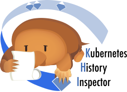
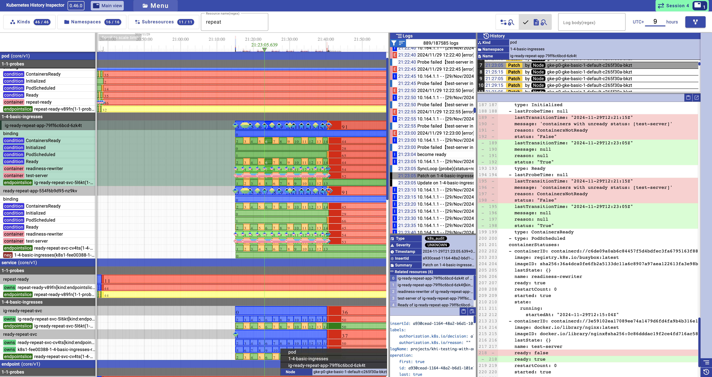
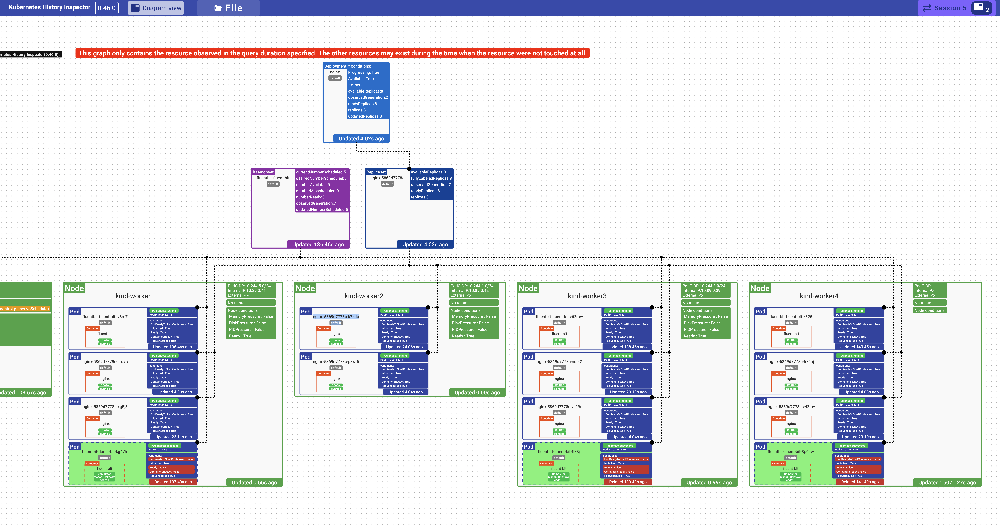
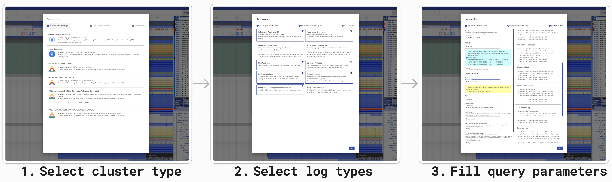
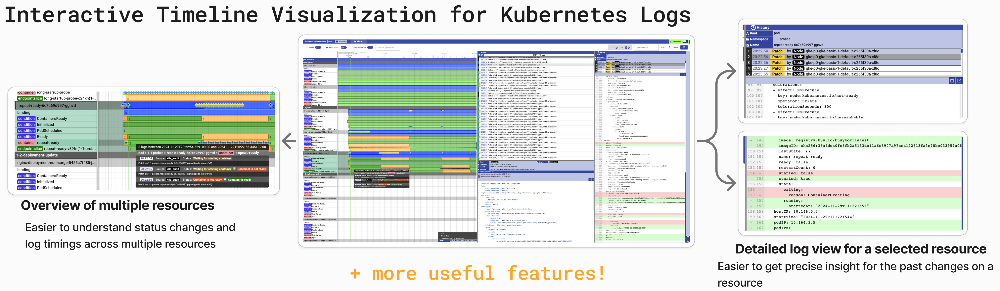
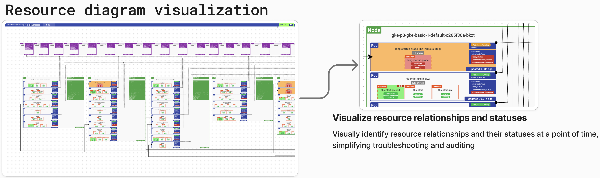

<p style="text-align: center;">
  <picture>
    <source media="(prefers-color-scheme: dark)" srcset="./docs/images/logo-dark.svg">
    
  </picture>
</p>

Language: English | [日本語](./README.ja.md)

<hr/>

# Kubernetes History Inspector

Kubernetes History Inspector (KHI) is a rich log visualization tool for Kubernetes clusters. KHI transforms vast quantities of logs into an interactive, comprehensive timeline view.
This makes it an invaluable tool for troubleshooting complex issues that span multiple components within your Kubernetes clusters.

Any agents are not needed on your cluster. KHI provides following visualizations for troubleshooting just by loading logs on Kubernetes.

|Timeline view|Cluster diagram view|
|---|---|
|||
|Visualize timings of resource status changes with timeline chart or diffs of manifests from kubernetes audit logs.|Visualize relationships among k8s resources just from kube-apiserver audit logs.|

## KHI features and characteristics

- **No Prior Setup Required:** KHI uses your existing logs, so you don't need to install anything extra. This makes setup easier and saves you time. Furthermore, you can use KHI to troubleshoot even past issues as long as logs are still available in your logging backend.

- **Effortless log collection:** KHI significantly simplifies the process of collecting and visualizing Kubernetes-related logs. Instead of writing complex queries, users can leverage an interactive GUI. By setting the target cluster type, log types, and parameters such as time range and cluster name, KHI automatically generates the necessary queries and collects the logs for visualization.



- **Comprehensive Visualization with Interactive Timelines:** KHI transforms vast quantities of logs into an interactive and comprehensive timeline view.
  - **Resource History Visualization:** KHI displays the status of resources on a timeline. It also parses audit logs and displays the resource manifest at a specific point in time, highlighting differences.
  - **Visualization of Multiple Log Types Across Multiple Resource Types:** KHI correlates various types of logs across related resources, providing a holistic view.
  - **Timeline Comparison of Logs Across Resources:** The timeline view allows users to compare logs across resources in the time dimension, making it easy to identify relationships and dependencies.
  - **Powerful Interactive Filters:** KHI intentionally loads a massive amount of logs into memory. This enables users to interactively filter logs and quickly pinpoint the information they need within the large dataset.



- **Cluster Resource Topology Diagrams (Early alpha feature):** KHI can generate diagrams that depict the state of your Kubernetes cluster's resources and their relationships at a specific point in time. This is invaluable for understanding the configuration and topology of your cluster during an incident or for auditing purposes.



## Supported environments

### Kubernetes cluster

- Google Cloud
  - [Google Kubernetes Engine](https://cloud.google.com/kubernetes-engine/docs/concepts/kubernetes-engine-overview)
  - [Cloud Composer](https://cloud.google.com/composer/docs/composer-3/composer-overview)
  - [GKE on AWS](https://cloud.google.com/kubernetes-engine/multi-cloud/docs/aws/concepts/architecture)
  - [GKE on Azure](https://cloud.google.com/kubernetes-engine/multi-cloud/docs/azure/concepts/architecture)
  - [GDCV for Baremetal](https://cloud.google.com/kubernetes-engine/distributed-cloud/bare-metal/docs/concepts/about-bare-metal)
  - [GDCV for VMWare](https://cloud.google.com/kubernetes-engine/distributed-cloud/vmware/docs/overview)

- Other
  - kube-apiserver audit logs as JSONlines ([Tutorial](./docs/en/oss.md))

### Logging backend

- Google Cloud
  - Cloud Logging (For all clusters on Google Cloud)

- Other
  - Log file upload ([Tutorial](./docs/en/oss.md))

## Getting started

### Run from a docker image

#### Supported environment

- Latest Google Chrome
- `docker` command

> [!IMPORTANT]
> We only test KHI with on the latest version of Google Chrome.
> KHI may work with other browsers, but we do not provide support if it does not.

#### Run KHI

1. Open [Cloud Shell](https://shell.cloud.google.com)
1. Run `docker run -p 127.0.0.1:8080:8080 asia.gcr.io/kubernetes-history-inspector/release:latest`
1. Click the link `http://localhost:8080` on the terminal and start working with KHI!

> [!TIP]
> If you want to run KHI with the other environment where the metadata server is not available,
> you can pass the access token via the program argument.
>
>```bash
>docker run -p 127.0.0.1:8080:8080 asia.gcr.io/kubernetes-history-inspector/release:latest -access-token=`gcloud auth print-access-token`
>```
>

> [!NOTE]
> The container image source may change in the near future. #21

For more details, please try [Getting started](./docs/en/getting-started.md).

### Run from source code

<details>
<summary>Get Started (Run from source)</summary>

#### Prerequisites

- Go 1.24.*
- Node.js environment 22.13.*
- [`gcloud` CLI](https://cloud.google.com/sdk/docs/install)
- [`jq` command](https://jqlang.org/)

#### Initialization (one-time setup)

1. Download or clone this repository
  e.g. `git clone https://github.com/GoogleCloudPlatform/khi.git`
1. Move to the project root
  e.g. `cd khi`
1. Run `cd ./web && npm install` from the project root

#### Build KHI from source and run

1. [Authorize yourself with `gcloud`](https://cloud.google.com/docs/authentication/gcloud)  
  e.g. `gcloud auth login` if you use your user account credentials
1. Run `make build-web && KHI_FRONTEND_ASSET_FOLDER=./dist go run cmd/kubernetes-history-inspector/main.go` from the project root
  Open `localhost:8080` and start working with KHI!

</details>

> [!IMPORTANT]
> Do not expose KHI port on the internet.
> KHI itself is not providing any authentication or authorization features and KHI is intended to be accessed from its local user.

### Authentication settings

## Settings for managed environments

### Google Cloud

#### Permissions

The following permissions are required or recommended.

- **Required**
  - `logging.logEntries.list`
- **Recommended**
  - Permissions to list clusters for cluster type (eg. `container.clusters.list` for GKE)
    This permission is used to show autofill candidates for the log filter. KHI's main functionality is not affected without this permission.
- **Setting**
  - Running KHI on environments with a service account attached, such as Google Cloud Compute Engine Instance: Apply the permissions above to the attached service account.
  - Running KHI locally or on Cloud Shell with a user account: Apply the permissions above to your user account.

> [!WARNING]
> KHI does not respect [ADC](https://cloud.google.com/docs/authentication/provide-credentials-adc) – running KHI on a Compute Engine Instances will always use the attached service account regardless of ADC.
> This specification is subject to change in the future.

#### Audit Logging

- **No required configuration**
  KHI fully works with the default audit logging configuration.
- **Recommended**
  - Kubernetes Engine API Data access audit logs for `DATA_WRITE`

> [!TIP]
> Enabling these will log every patch requests on Pod or Node `.status` field.
> KHI will use this to display detailed container status.
> KHI will still guess the last container status from the audited Pod deletion log even without these logs, however it requires the Pod to be deleted within the queried timeframe.

- **Setup**
  1. In the Google Cloud Console, [go to the Audit Logs](https://console.cloud.google.com/iam-admin/audit) page.
  1. In the Data Access audit logs configuration table, select  `Kubernetes Engine API` from the Service column.
  1. In the Log Types tab, select the `Data write` Data Access audit log type
  1. Click "SAVE".

### OSS Kubernetes

Please check out [Using KHI with OSS Kubernetes Clusters - Example with Loki](./docs/en/oss.md).

## User Guide

Please check our [user guide](./docs/en/user-guide.md).

## Contribute

If you'd like to contribute to the project, please read our [Contributing guide](./docs/contributing.md).

## Disclaimer

Please note that this tool is not an officially supported Google Cloud product. If you find any issues and have a feature request, please [file a Github issue on this repository](https://github.com/GoogleCloudPlatform/khi/issues/new?template=Blank+issue) and we are happy to check them on best-effort basis.
