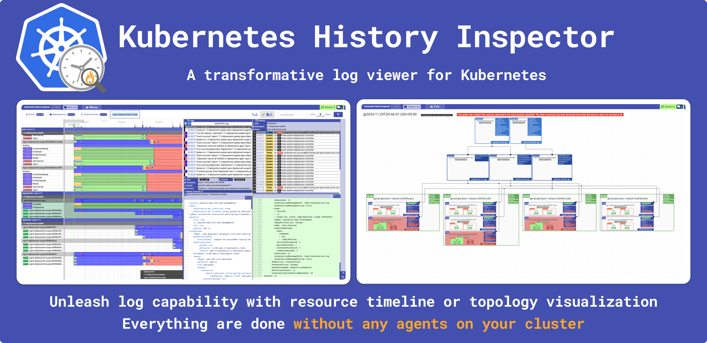

# Kubernetes History Inspector

Language: English | [日本語](./README.ja.md)



Kubernetes History Inspector (KHI) is a rich log visualization tool for Kubernetes clusters. KHI transforms vast quantities of logs into an interactive, comprehensive timeline view.
This makes it an invaluable tool for troubleshooting complex issues that span multiple components within your Kubernetes clusters.

## KHI features and characteristics

- **No Prior Setup Required:** KHI uses your existing logs, so you don't need to install anything extra. This makes setup easier and saves you time. Furthermore, you can use KHI to troubleshoot even past issues as long as logs are still available in your logging backend.

- **Effortless log collection:** KHI significantly simplifies the process of collecting and visualizing Kubernetes-related logs. Instead of writing complex queries, users can leverage an interactive GUI. By setting the target cluster type, log types, and parameters such as time range and cluster name, KHI automatically generates the necessary queries and collects the logs for visualization.


- **Comprehensive Visualization with Interactive Timelines:** KHI transforms vast quantities of logs into an interactive and comprehensive timeline view.
  - **Resource History Visualization:** KHI displays the status of resources on a timeline. It also parses audit logs and displays the resource manifest at a specific point in time, highlighting differences.
  - **Visualization of Multiple Log Types Across Multiple Resource Types:** KHI correlates various types of logs across related resources, providing a holistic view.
  - **Timeline Comparison of Logs Across Resources:** The timeline view allows users to compare logs across resources in the time dimension, making it easy to identify relationships and dependencies.
  - **Powerful Interactive Filters:** KHI intentionally loads a massive amount of logs into memory. This enables users to interactively filter logs and quickly pinpoint the information they need within the large dataset.


- **Cluster Resource Topology Diagrams (Early alpha feature):** KHI can generate diagrams that depict the state of your Kubernetes cluster's resources and their relationships at a specific point in time. This is invaluable for understanding the configuration and topology of your cluster during an incident or for auditing purposes.


## Supported environments

### Kubernetes cluster

- Google Cloud
  - [Google Kubernetes Engine](https://cloud.google.com/kubernetes-engine/docs/concepts/kubernetes-engine-overview)
  - [Cloud Composer](https://cloud.google.com/composer/docs/composer-3/composer-overview)
  - [GKE on AWS](https://cloud.google.com/kubernetes-engine/multi-cloud/docs/aws/concepts/architecture) 
  - [GKE on Azure](https://cloud.google.com/kubernetes-engine/multi-cloud/docs/azure/concepts/architecture)
  - [GDCV for Baremetal](https://cloud.google.com/kubernetes-engine/distributed-cloud/bare-metal/docs/concepts/about-bare-metal)
  - [GDCV for VMWare](https://cloud.google.com/kubernetes-engine/distributed-cloud/vmware/docs/overview)

- Other
  - kube-apiserver audit logs as JSONlines (Coming soon)

### Logging backend

- Google Cloud
  - Cloud Logging (For all clusters on Google Cloud)

- Other
  - Log file upload (Coming soon)

## Getting started

### Run from a docker image

#### Supported environment

- Latest Google Chrome

> [!IMPORTANT]
> We only test KHI with the latest Google Chrome. 
> KHI may work with the other browser, but we will not support even if it won't work with the other browser.

#### Run KHI

1. Open [Cloud Shell](https://shell.cloud.google.com)
1. Run `docker run -p 8080:8080 asia.gcr.io/kubernetes-history-inspector/release:latest`
1. Click the link `http://localhost:8080` on the terminal and start working with KHI!

> [!TIP]
> If you want to run KHI with the other environment where the metadata server is not available,
> you can pass the access token via the program argument.
>
>```
>$ docker run -p 8080:8080 asia.gcr.io/kubernetes-history-inspector/release:latest -host 0.0.0.0 -access-token=`gcloud auth print-access-token`
>```

> [!NOTE]
> The container image source may change in the soon future. #21


### Run from source code

<details>
<summary>Get Started (Run from source)</summary>

#### Prerequisites
- Go 1.23.*
- Node.js environment 18.19.*
- [`gcloud` CLI](https://cloud.google.com/sdk/docs/install)

#### Initialization (one-time setup)
1. Download or clone this repository   
  e.g. `git clone https://github.com/GoogleCloudPlatform/khi.git`
1. Move to the project root   
  e.g. `cd khi`
1. Run `cd ./web && npm install` from the project root

#### Run KHI
1. [Authorize yourself with `gcloud`](https://cloud.google.com/docs/authentication/gcloud)  
  e.g. `gcloud auth login` if you use your user account credentials
1. Run `make build-web && KHI_FRONTEND_ASSET_FOLDER=./dist go run cmd/kubernetes-history-inspector/main.go` from the project root   
  Open `localhost:8080` and start working with KHI! 

</details>

## User Guide

Please check our [user guide](./docs/user-guide.md).

## Contribute

If you'd like to contribute to the project, please read our [Contributing guide](./docs/contributing.md).

## Disclaimer

Please note that this tool is not an officially supported Google Cloud product. If you find any issues and have a feature request, please [file a Github issue on this repository](https://github.com/GoogleCloudPlatform/khi/issues/new?template=Blank+issue) and we are happy to check them on best-effort basis.
