# User guide

> [!NOTE]
> This document explains how to use KHI after running it. If you haven't run KHI, please check [README](../../README.md).

## Query logs with KHI

Once you run KHI and open the page served by it, you will see the welcome page.
You can query your logs with clicking the `New inspection` button, or you can open KHI file.
After completing querying your logs with the later instruction, you would see the inspection list on right side.

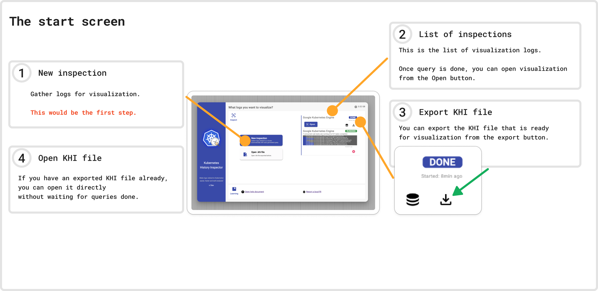

To query your cluster logs, you would need to fill few information with 3 steps.

1. Select the cluster type
1. Select log types to query
1. Fill parameters needed for composing log filter

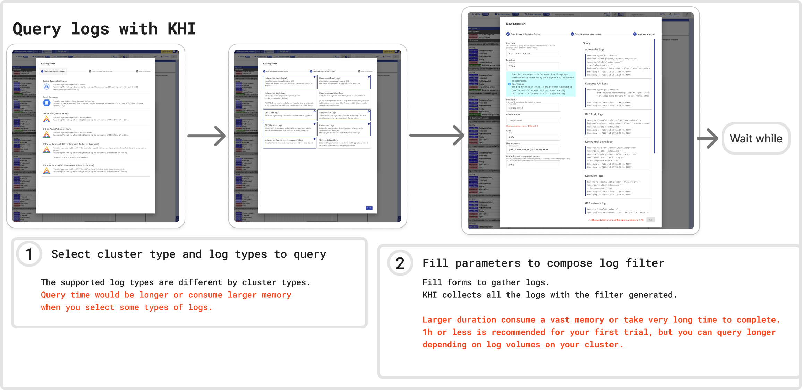

After clicking the `Run` button on the query dialog, you will see progress bars on the start screen.
Once the query done, you can open the visualization result with hitting the `Open` button.

## Understanding the visualization

After opening the log, you will see a colorful visualization. 
This is the main view of KHI, and you can see the timeline diagram on the left side, which reveals the macroscopic behavior of resources in your cluster.
The right side is dedicated to details of each resource. You can see detailed information by selecting a resource in the timeline.

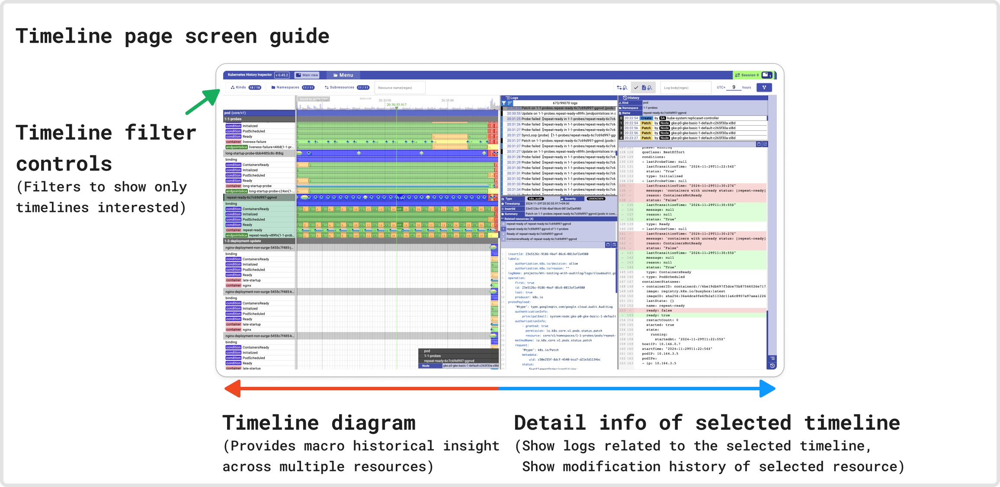

### Timeline view

Timelines in the diagram are displayed in hierarchical order (Kind > Namespace > Resource name > Subresource).
To scale the timeline diagram in or out, hold the Shift key and scroll your mouse. KHI will scale the view around the time point at your mouse pointer location.

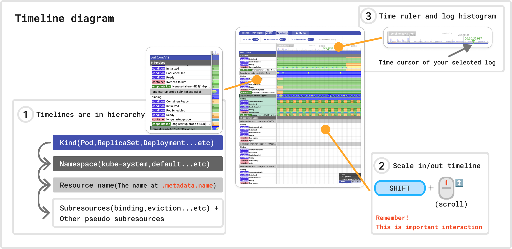

The colorful belts on the timelines are called `revisions`. Each revision represents a state that continues from its left edge (start time) to its right edge (end time).
You can see the meaning of each color by hovering your mouse pointer over the revision.

KHI also shows several supplemental timelines as pseudo-subresource timelines. These pseudo-subresources are not actual subresources in Kubernetes, but KHI associates these complementary timelines with resources for better visualization. The color meanings of these pseudo-subresources may vary depending on their relationship with their parent resource.
This relationship is indicated by a colorful chip next to the subresource name on the left side.

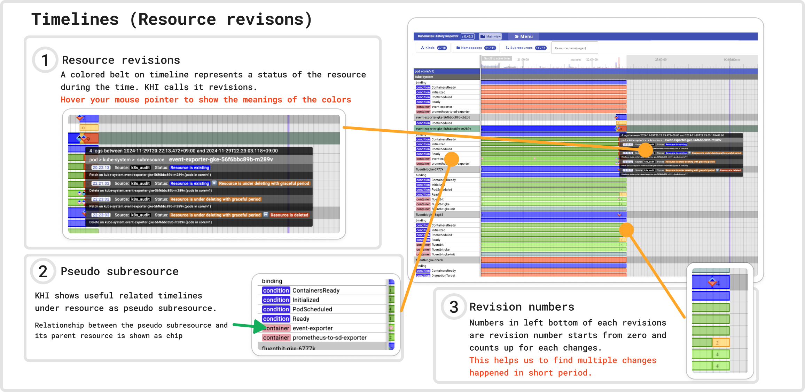

Diamond shapes on the timelines are called `events` in KHI (note that these are not Kubernetes events). These indicate that a log was associated with the resource at that specific time.
The colors of the events indicate their severity and log type. Hover your mouse pointer over an event to see its details.

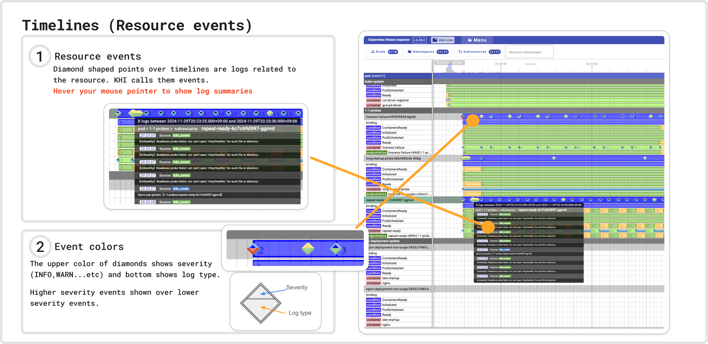

Clicking on a timeline's name or any element within it will select that timeline. The log view and history view on the right side of the timeline diagram will then display data corresponding to the selected timeline.

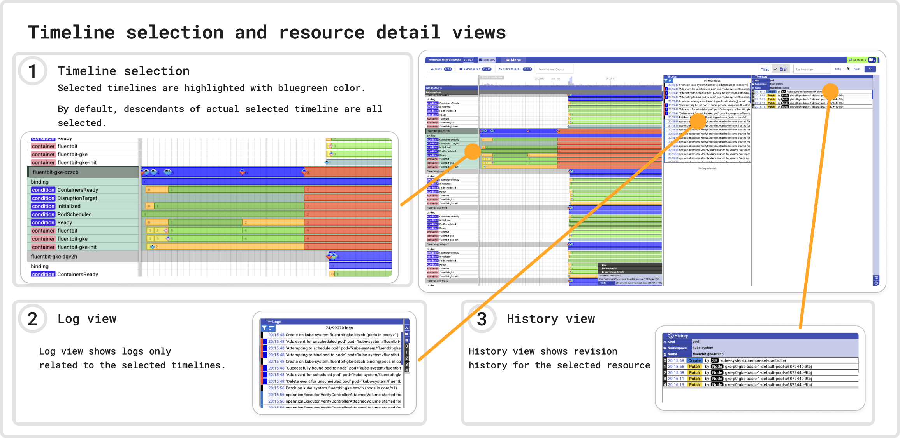

### Log view

The log view automatically shows only the logs related to the selected timeline.

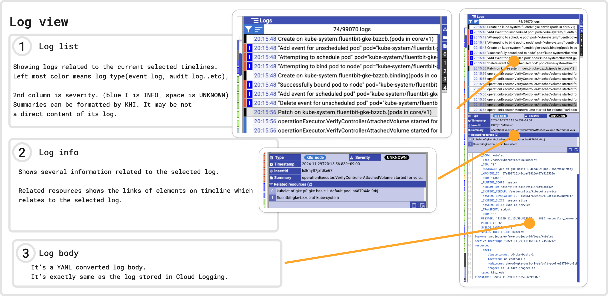

### History view

The history view shows the modification history of the selected timeline.

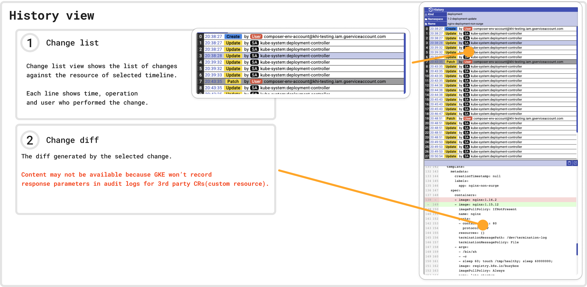

### Filtering features

You can filter timelines by Kind, Namespace, and Resource name using the input fields at the top left of the timeline diagram.
This allows you to quickly narrow down the displayed timelines to only those relevant to your current investigation.

You can also filter logs using a regular expression in the input field at the top right. This will also filter out timelines that do not have any logs matching the regex.

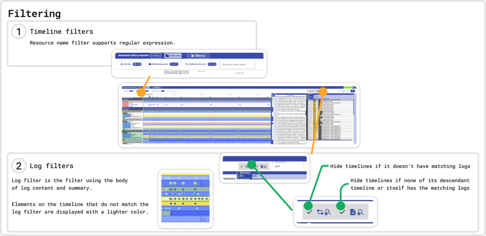

### Topology view (alpha)

The Topology view provides a visual representation of the relationships between different Kubernetes resources.
This can be helpful for understanding the resource topology at a specific point in time within a log.

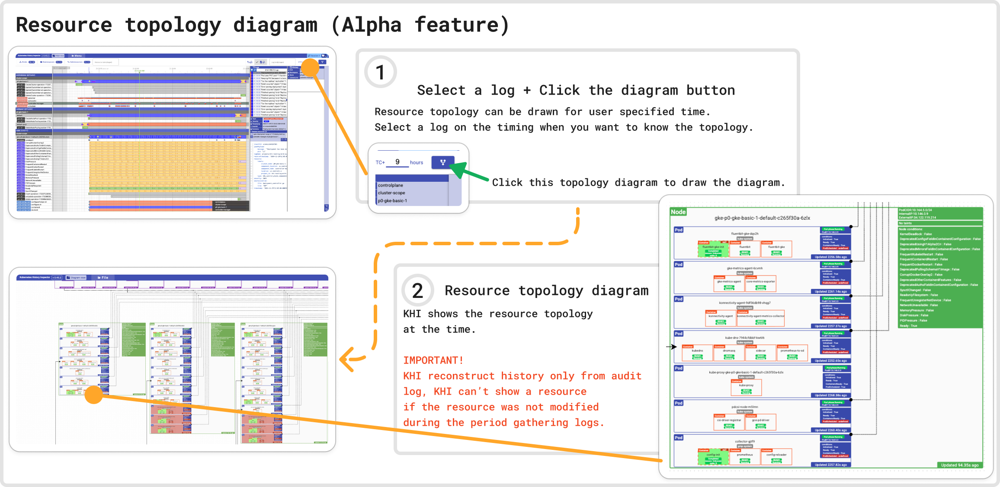