# ユーザーガイド

> [!NOTE]
> このドキュメントでは、KHI起動後の使用方法について説明します。KHIを起動していない場合は、[README](../../README.ja.md) をご確認ください。

## ログをクエリする

KHIを実行してページを開くと、ウェルカムページが表示されます。
`New inspection` ボタンをクリックしてログをクエリするか、KHIファイルを開くことができます。
後述の手順でログのクエリが完了すると、右側にインスペクションリストが表示されます。

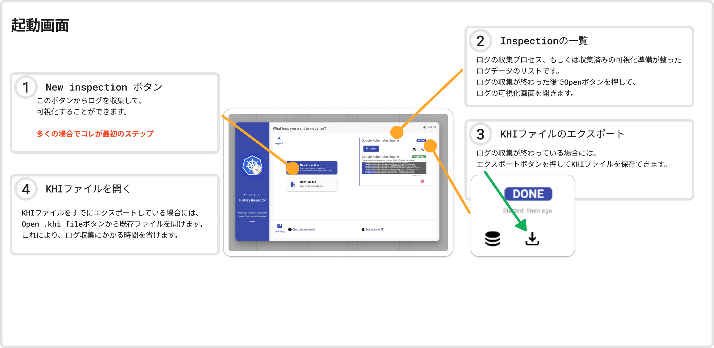

ログをクエリするには、3つのステップでいくつかの情報を入力する必要があります。

1. クラスタの種類を選択します。
2. クエリするログタイプを選択します。
3. ログフィルタの作成に必要なパラメータを入力します。

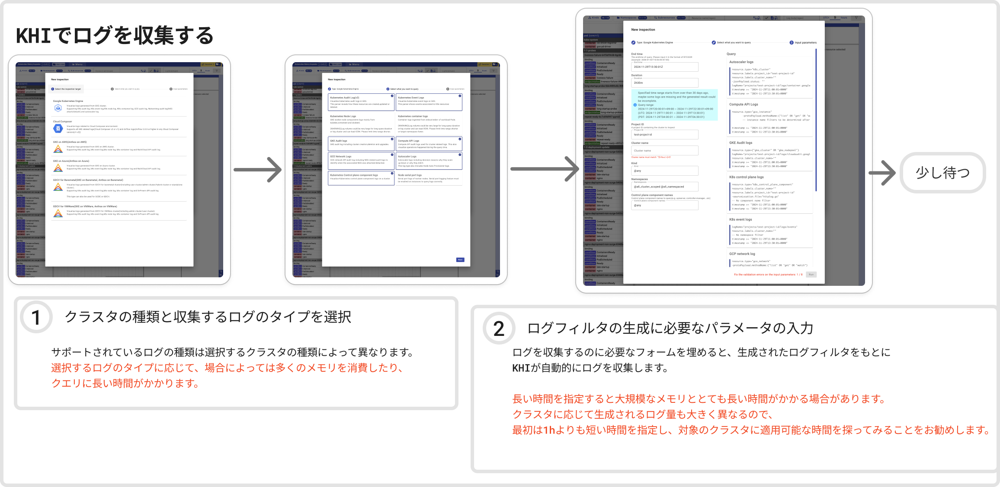

クエリダイアログの `Run` ボタンをクリックすると、スタート画面にプログレスバーが表示されます。
クエリが完了したら、`Open` ボタンをクリックして結果を開くことができます。

## ビュー

クエリ完了後の結果を開くと、KHI のメインビューとしてカラフルな可視化画面が表示されます。
画面左側にはクラスタ内のリソースの全体の状況を把握するためのタイムラインビューが、
右側は各リソースの詳細情報が表示されます。タイムライン上でリソースを選択すると、そのリソースの詳細情報を確認できます。

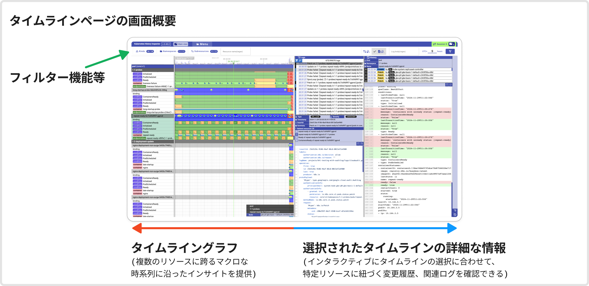

### タイムラインビュー

図中のタイムラインは、階層順 (Kind > Namespace > リソース名 > サブリソース) に表示されます。
タイムラインを拡大または縮小するには、Shiftキーを押しながらマウスをスクロールします。KHIは、マウスポインタの位置にある時点を中心にビューを拡大縮小します。

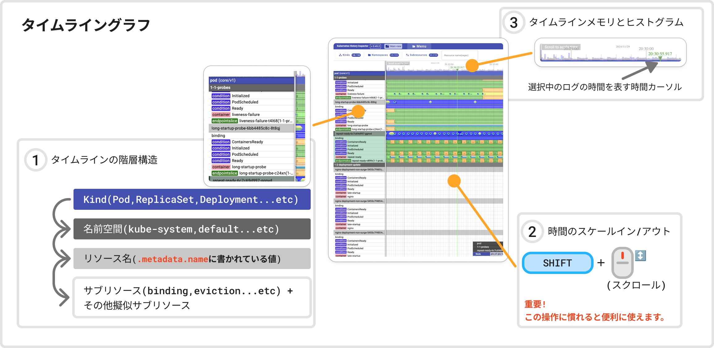

タイムライン上のカラフルな帯は `リビジョン` と呼ばれます。リビジョンは、開始時刻（左端）から終了時刻（右端）まで、リソースが特定の状態にあったことを示します。
リビジョンにマウスポインタを合わせると、各色の意味を確認できます。

KHIは補足的なタイムラインをサブリソースであるかのように表示します。これを疑似サブリソースと呼びます。疑似サブリソースはKubernetesの実際​​のサブリソースではありませんが、可視性を高めるために、関連するリソースに紐づけて表示されます。これらの擬似サブリソースのタイムラインの色は、親リソースとの関係性によって異なる場合があります。
この関係は、左側のサブリソース名の横にあるカラフルなチップで示されます。

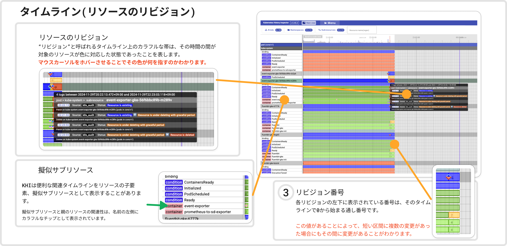

タイムライン上のダイヤ形の点は、 `イベント` と呼ばれます。これらはKubernetesのイベントではないことに注意してください。イベントは、該当時間に該当リソースに関連するログが存在していることを示します。
イベントの色は、重大度とログの種類を示します。イベントにマウスポインタを合わせると、詳細が表示されます。

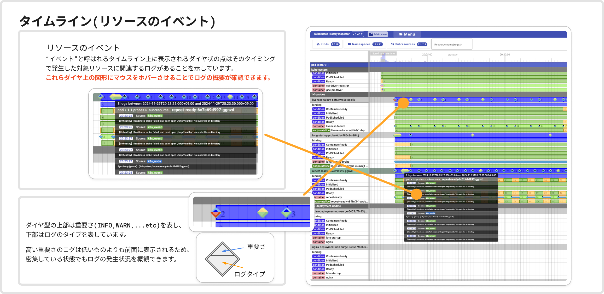

タイムラインの名前またはその中の要素をクリックすると、該当タイムラインが選択されます。タイムラインビューの右側にあるログビューと履歴ビューには、選択したタイムラインに対応するデータが表示されます。

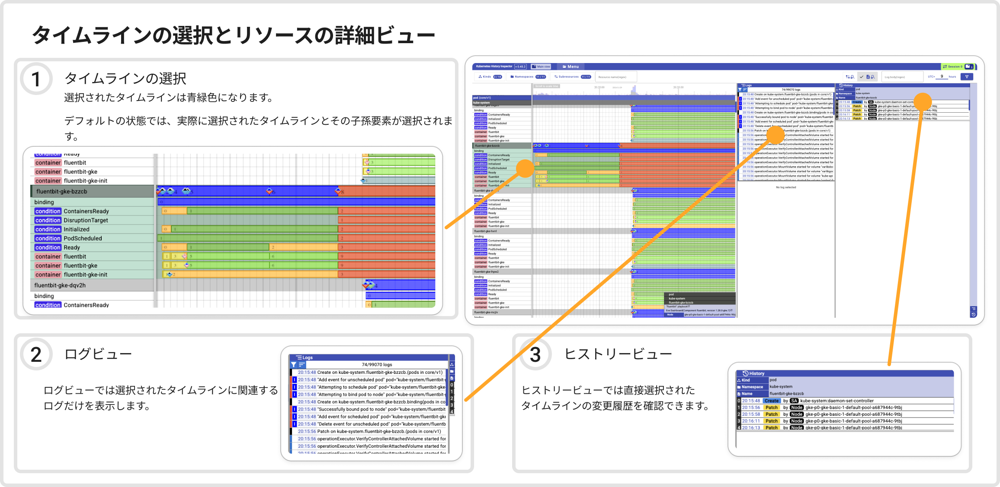

### ログビュー

ログビューには、選択したタイムラインに関連するログのみ表示されます。

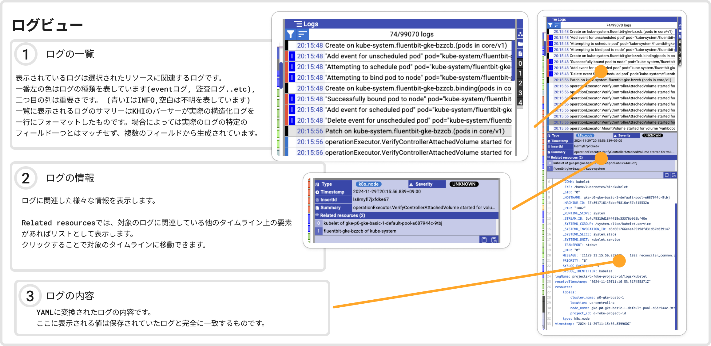

### ヒストリービュー

ヒストリービューには、選択したタイムラインの変更履歴が表示されます。

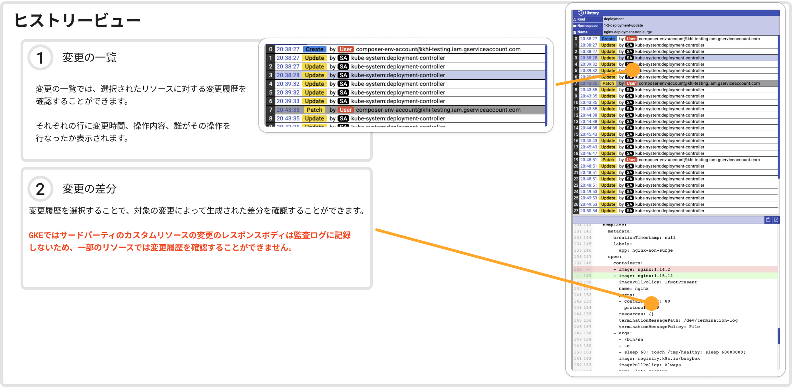

### フィルタリング

タイムラインビューの左上にある入力フィールドを使用して、Kind、名前空間、およびリソース名でタイムラインを絞り込めます。

また、右上の入力フィールドでは正規表現でログを絞り込めます。一致するログがないタイムラインは非表示になります。

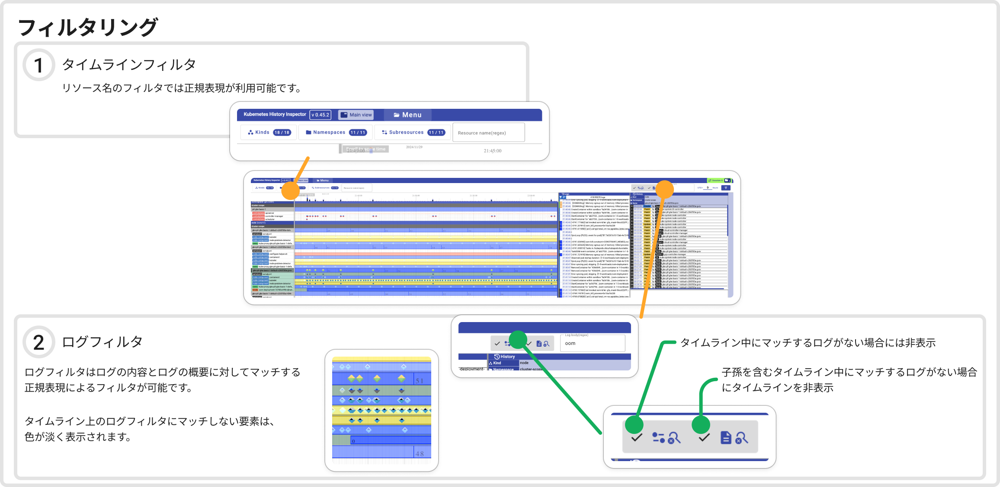

### リソースの関連性の可視化（アルファ版）

リソース関連性可視化機能を使用すると、クラスタ内のKubernetesリソース間の関係性を特定のタイミングで視覚的に確認できます。
これにより、ログに記録された特定時点でのリソース同士の関連性を容易に把握することができます。

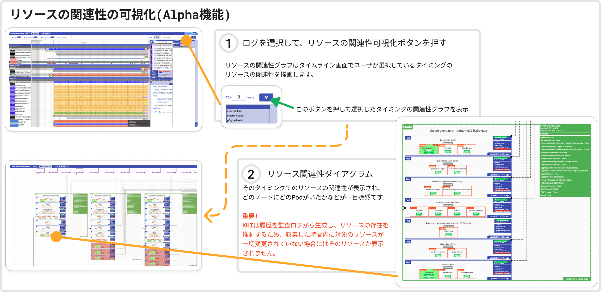